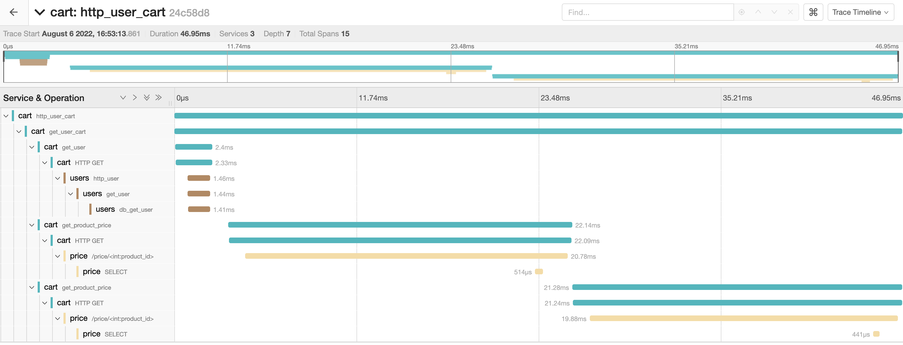

# OpenTelemetry shopping cart application

Sample/demo application to highlight distributed tracing and other aspects with [OpenTelemetry](https://opentelemetry.io/). Some features about this sample application are that it highlights tracing and propagation through multiple services in different languages (Go and Python). It also illustrates manual instrumentation extensively as well as automatic instrumentation with Flask and MySQL.

## Application design


There are three services in this application:

* **Cart** - Service handling user requests for shopping cart data (written in Go)
* **User** - Handles user verification and lookup requests from the cart service (written in Go)
* **Price** - Serves update pricing information for products (written in Python)

The backend persistent application data storage is with **MySQL**.

Instrumentation is entirely with OpenTelemetry's APIs and SDKs. Telemetry collection is achieved through the [OpenTelemetry Collector](https://github.com/open-telemetry/opentelemetry-collector) sending trace data to Jaeger.

## Running local

To run this locally you need [kind](https://kind.sigs.k8s.io/). Once you have kind, you can run:

```
$ make deploy
```

Once the deployment succeeds (verify pod statuses with `kubectl get po`), you can curl the cart service:

```
$ curl -H "host:shopping" localhost/cart/tlasagna
```

Then navigate to the Jaeger instance and view the trace data:



## Cleanup

To cleanup the local instance, run:

```
$ make clean
```
