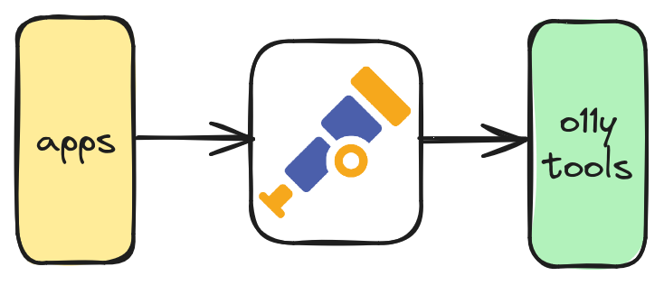
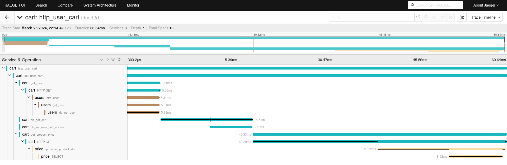
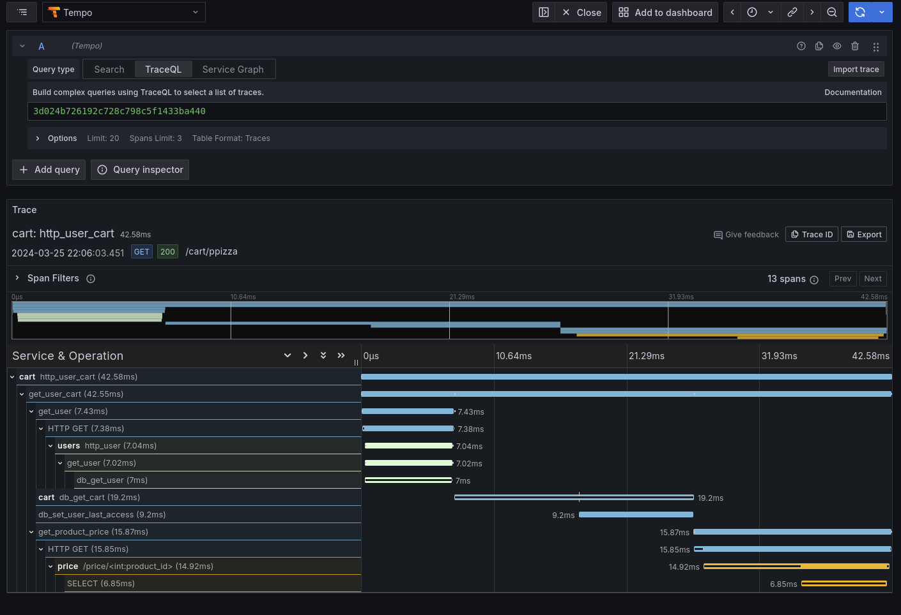
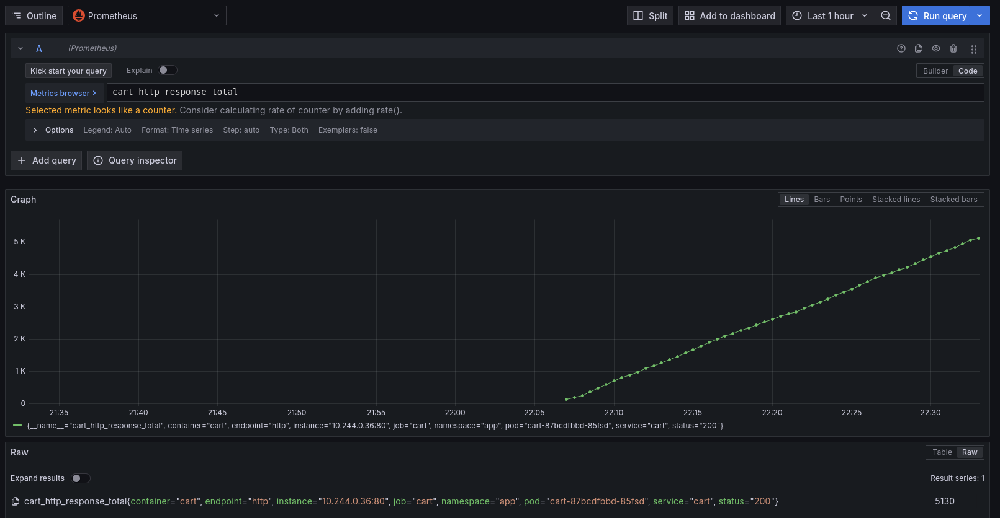
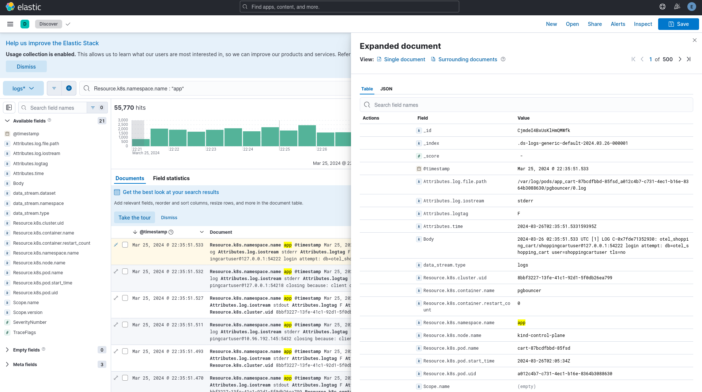
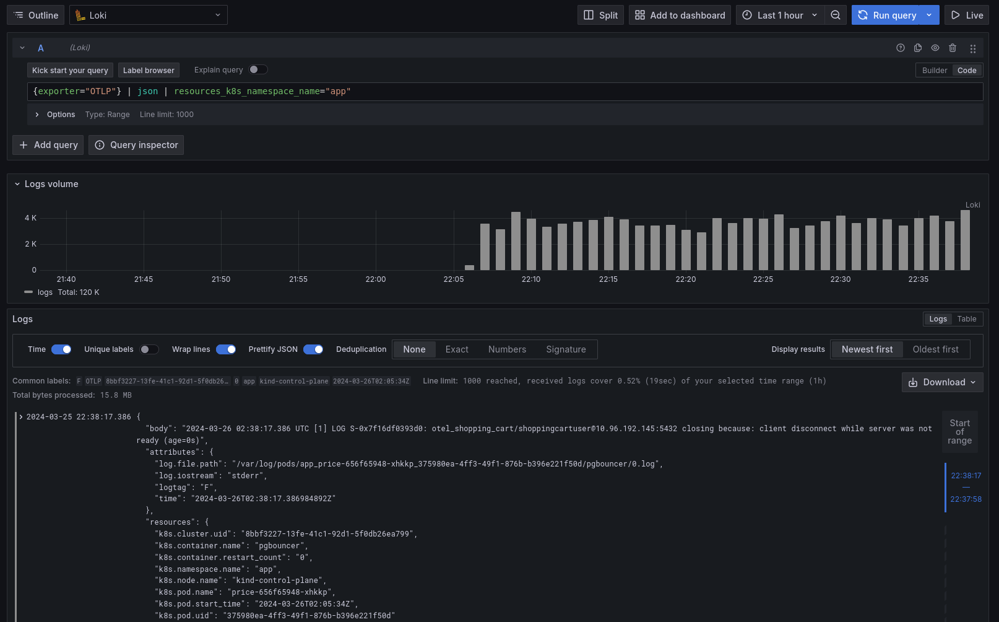
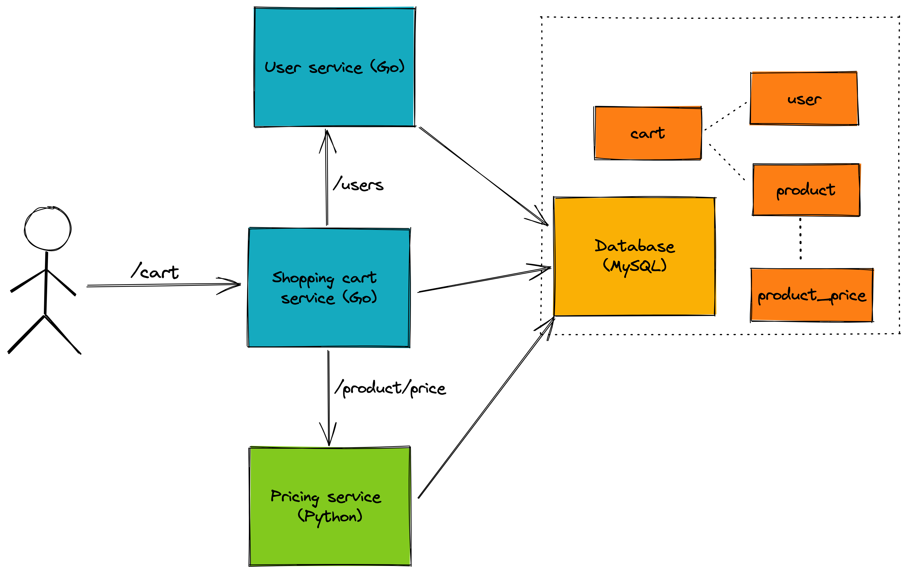

# OpenTelemetry shopping cart application

Sample application to highlight distributed tracing and other aspects with [OpenTelemetry](https://opentelemetry.io/) including:

* Microservices
* Traffic generator
* Quality of service interruptor
* Traces, metrics, and logs all through OpenTelemetry
* A variety of observability backends for consumption

## Why?

OpenTelemetry can be thought of as observability middleware:



These three "layers" can be considered a full implementation. This repo aims at providing all of them (the microservices applications, the OpenTelemetry implementation, and observability backends).

Instead of taking an opinionated approach on what observability backends should be included, this ships multiple:

* Metrics - Prometheus
* Traces - Jaeger and Grafana Tempo
* Logs - Elasticsearch and Grafana Loki

## Usage

There are a few ways to "use" this repository...

### Everything running local in a new kind cluster

```bash
make run-local
```

### Everything in an existing cluster

```bash
make install-tools-and-app
```

### Just the sample application

```bash
make install-app
```

### Just the observability tools

```bash
make install-tools
```

## Viewing telemetry

### Traces

#### Jaeger

```bash
$ make port-forward-jaeger
```



#### Tempo

```bash
$ make port-forward-grafana
```



### Metrics

```bash
$ make port-forward-grafana
```



### Logs

#### Elasticsearch

```bash
$ make port-forward-kibana
```



#### Loki

```bash
$ make port-forward-grafana
```



## Cleanup

To cleanup the local environment:

```
$ make stop-local
```

## Application design



There are three services in this application:

* **Cart** - Service handling user requests for shopping cart data (written in Go)
* **User** - Handles user verification and lookup requests from the cart service (written in Go)
* **Price** - Serves update pricing information for products (written in Python)

The backend persistent application data storage is with **PostgreSQL**.

Instrumentation is entirely with OpenTelemetry's APIs and SDKs. Telemetry collection is achieved through the [OpenTelemetry Collector](https://github.com/open-telemetry/opentelemetry-collector) sending trace data to Jaeger.
